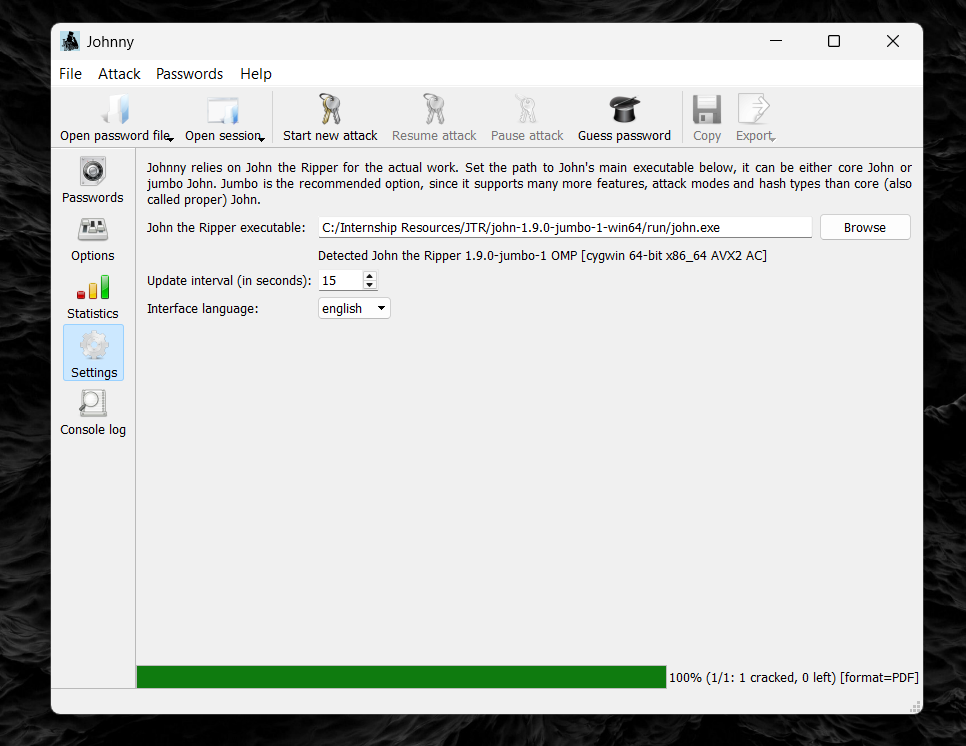
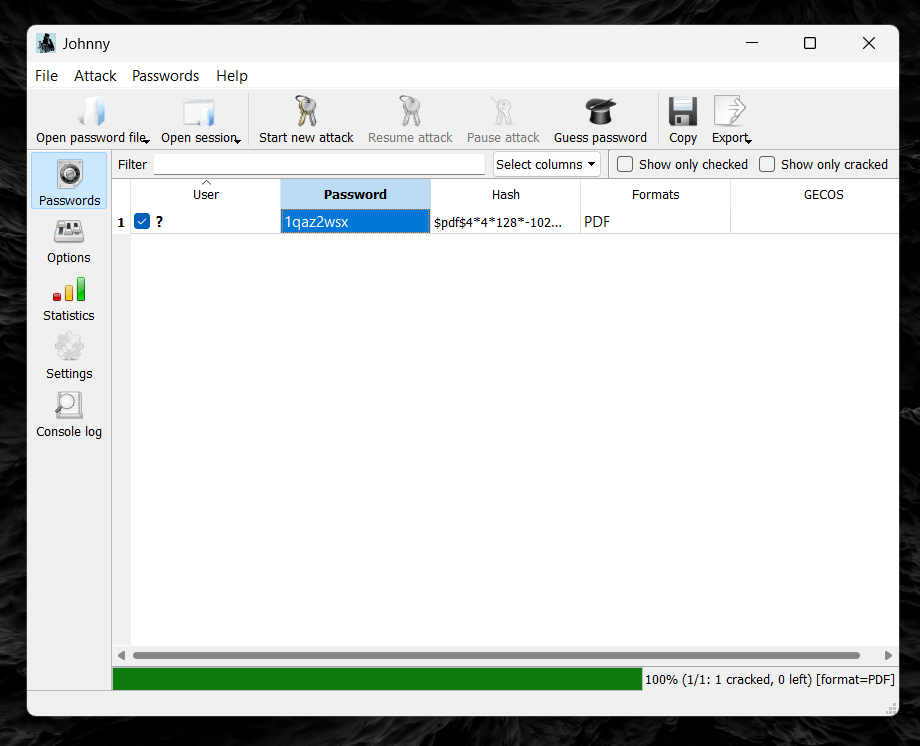
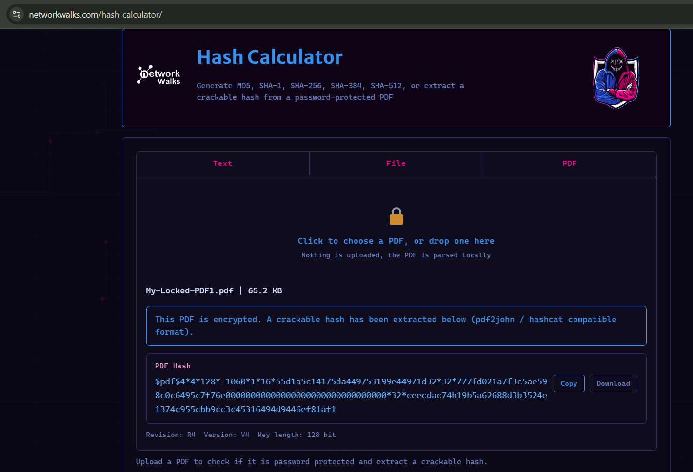
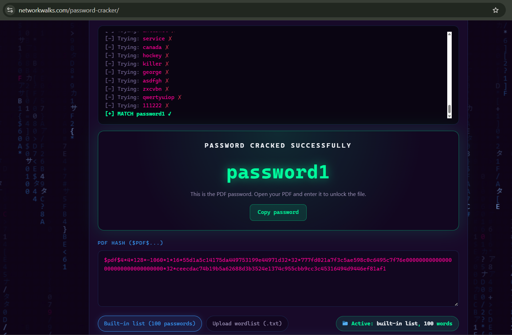
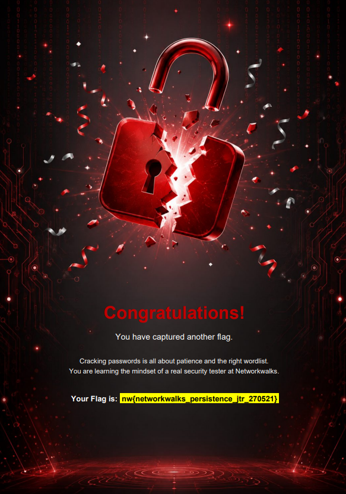
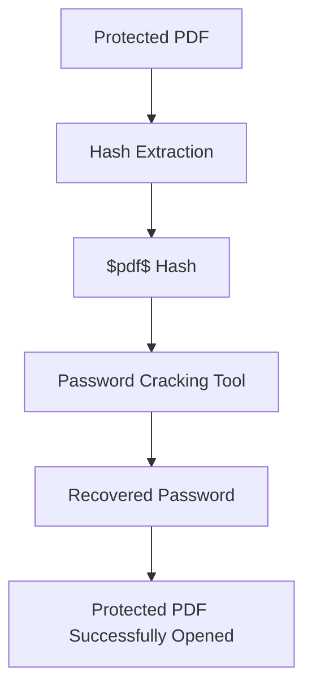
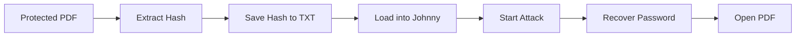
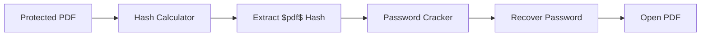

# Week 3 – Password Cracking with John the Ripper & NetworkWalks Tools

## Overview

This project explores password cracking against protected PDF files using John the Ripper, Johnny, and NetworkWalks password-cracking tools. The work was performed on a Windows laptop and consisted of two modules:

1. **Module 1** – Password Cracking with JTR (John the Ripper + Johnny GUI)
2. **Module 2** – Password Cracking with NetworkWalks Hash Calculator & Password Cracker

Both modules follow the same underlying concept: password-protected PDFs use password-derived cryptographic data that can be extracted in a format supported by password-cracking tools. This data is first extracted from the file, then run through a cracking tool that tries candidate passwords until a match is found. This lab demonstrates that workflow end-to-end, from hash extraction to successful PDF decryption.

## Objectives

- Understand password hashing and password cracking
- Understand the difference between hashing and encryption
- Extract password hashes from protected PDF files
- Configure and use John the Ripper
- Use Johnny as the graphical interface for John the Ripper
- Use the NetworkWalks Hash Calculator
- Use the NetworkWalks Password Cracker
- Understand why weak passwords are vulnerable to cracking
- Validate recovered passwords by opening the protected PDFs

## Module 1 — Password Cracking with JTR

John the Ripper (JTR) is a widely used password auditing and recovery tool that supports many hash types, including password-protected PDFs. **Johnny** is the graphical front end for JTR, allowing the same cracking engine to be used without the command line.

**Workflow:**

1. Download John the Ripper (jumbo build) and the Johnny GUI for Windows.
2. Install Johnny and, under **Settings**, point it to `john.exe` inside the JTR `run` folder.
3. Extract the PDF hash using an online PDF hash extractor.
4. Save the extracted hash (starting with `$pdf$`) into a text file.
5. In Johnny, use **Open password file** to load the saved hash file.
6. Click **Start new attack** to begin cracking.
7. Once cracked, the recovered password appears in the Johnny password list.
8. Use the recovered password to open the encrypted PDF and confirm access.

### JTR Setup

This screenshot shows Johnny configured with the path to the John the Ripper executable, confirming that JTR (jumbo build) was correctly detected and ready to run attacks.

### JTR Cracking Result

This screenshot demonstrates a successful password recovery using Johnny/JTR against the extracted PDF hash. All three provided passwords were successfully recovered during the practical exercise; only one cracking-result screenshot was retained for this README, so the image above represents the general outcome of the process rather than all three results individually.

## Module 2 — Password Cracking with NetworkWalks Tools

This module uses two free browser-based tools built by NetworkWalks: the **Hash Calculator** and the **Password Cracker**, which together replicate the JTR workflow without requiring any local installation.

**Workflow:**

1. Obtain the protected PDF.
2. Upload it to the NetworkWalks Hash Calculator.
3. Extract the `$pdf$...` hash.
4. Copy the complete hash.
5. Open the NetworkWalks Password Cracker.
6. Paste the hash.
7. Start the attack.
8. Wait for the password to be recovered.
9. Use the recovered password to open the PDF.

### Hash Extraction

This screenshot shows the NetworkWalks Hash Calculator extracting a crackable `$pdf$` hash directly from the locked PDF, entirely in-browser.

### Password Cracking Result

This screenshot demonstrates the NetworkWalks Password Cracker successfully recovering the password from the extracted PDF hash. As with Module 1, this screenshot documents the representative result of the process, not every individual PDF cracked.

## Password Recovery Validation

The final step in both modules was opening the protected PDFs using the recovered passwords, confirming that the cracked credentials were correct.

These three screenshots confirm that each protected PDF could be successfully opened using its respective recovered password.

## Overall Workflow

### JTR Workflow

### NetworkWalks Workflow

## Key Concepts Learned

### Hashing
Hashing is a one-way function that scrambles plain text into a unique message digest. It cannot be reversed directly — cracking tools work by hashing candidate passwords and comparing the result to the stored hash.

### Encryption
Unlike hashing, encryption is a two-way function: data encrypted with a key can be decrypted back to plaintext using the appropriate key.

### Password Cracking
Password cracking involves systematically trying candidate passwords — via a wordlist or dictionary attack — against a stored hash until a match is found.

### Why Password Strength Matters
Short or common passwords can be recovered more quickly because they are more likely to be encountered among candidate passwords. Longer and less predictable passwords generally increase the search space and make recovery more difficult.

## Ethical & Security Considerations

These exercises were performed in a controlled internship/lab environment on protected PDF files explicitly provided for cybersecurity education by NetworkWalks. Password-cracking techniques demonstrated here should only ever be applied to systems or files for which explicit authorization has been granted.

## Tools & Technologies

| Tool | Purpose |
|---|---|
| John the Ripper | Password cracking |
| Johnny | GUI for John the Ripper |
| NetworkWalks Hash Calculator | PDF hash extraction |
| NetworkWalks Password Cracker | Password recovery from hash |
| Windows | Lab environment |
| PDF | Protected file format used in the exercise |

## Evidence

| # | Screenshot | Evidence |
|---|---|---|
| 1 | 01_Johnny_JTR_Setup.png | Johnny/JTR configuration |
| 2 | 02_JTR_Cracked_Password.png | Successful JTR password recovery |
| 3 | 03_NetworkWalks_Hash_Extraction.png | PDF hash extraction |
| 4 | 04_NetworkWalks_Cracked_Password.png | Successful NetworkWalks password recovery |
| 5 | 05_PDF_1_Unlocked.png | PDF successfully opened |
| 6 | 06_PDF_2_Unlocked.png | PDF successfully opened |
| 7 | 07_PDF_3_Unlocked.png | PDF successfully opened |

## Learning Outcome

This project provided hands-on experience with the full password-cracking workflow: extracting a hash from a protected file, running that hash through both a native cracking tool (John the Ripper via Johnny) and a browser-based alternative (NetworkWalks Hash Calculator + Password Cracker), and validating the recovered credentials by successfully opening the originally locked PDFs. It reinforced the practical difference between hashing and encryption, and made clear why weak, predictable passwords are trivial to recover compared to stronger, more complex ones.

I would also like to thank NetworkWalks for this opportunity, which has allowed me to learn, grow, and further develop my cybersecurity skills.

## Author
Karthik Raman Keerangudi Kalyanaraman
Cybersecurity Intern and Enthusiast
